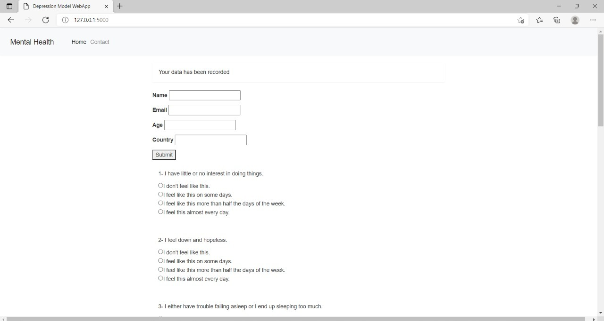

# Team Da Vinci Code PS5

To create an informative AI-based tool that should be able to give alerts and identify cases of mental health issues in children and also track the improvement status in identified cases. It should be able to track mental health issues prevalent in children from birth to the ones which they acquired later in their life for remediation and counselling. The tool should support teacher’s assessment as well as parental and self-assessment.

## Authors

- [@Kunal Dhurwey](https://github.com/kunaldhurwey04032001)
- [@Anshuman Mohanty]
- [@Aditya Nigam]
- [@J Varun Iyer]
- [@Shruti Verma]
- [@Sachin Malve]
## Tech Stack
**ML Model :** Python, numpy, pandas, sklearn  
**Front End :** HTML,CSS  
**Back End :** JavaScript,Flask ,Firebase

